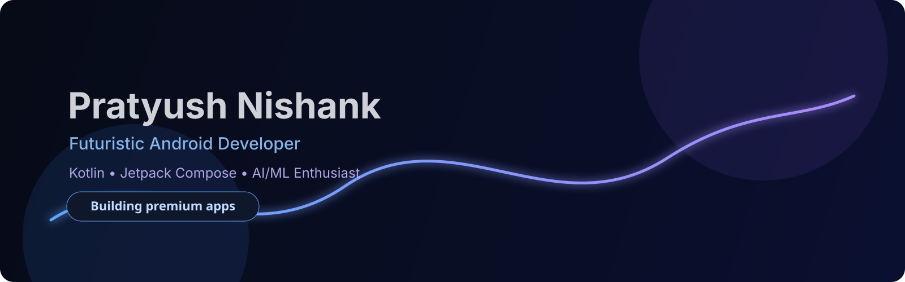

<div align="center">
  
</div>

<div align="center">
  
</div>

<p align="center">
  
  
  
</p>


##  About Me

```kotlin
val pratyush = Developer(
    name = "Pratyush Nishank",
    role = "Android Developer",
    stack = listOf("Kotlin", "Jetpack Compose", "Android Architecture"),
    interests = listOf("AI/ML", "Productive UX", "Performance-first apps")
)
```

- I craft **premium Android experiences** with a strong focus on clean architecture and elegant UI.
- I specialize in **Kotlin + Jetpack Compose** for modern, responsive, and maintainable mobile apps.
- I explore **AI/ML integrations** that make apps smarter and more human-centric.


##  Tech Stack

<p align="center">
  
</p>

<p align="center">
  
  
  
</p>


##  Featured Projects

<table>
  <tr>
    <td width="50%" valign="top">
      <h3>🕒 Timelyst</h3>
      <p><b>Live on Play Store</b></p>
      <p>Smart timetable app designed for intuitive schedule planning and daily productivity.</p>
    </td>
    <td width="50%" valign="top">
      <h3>🧠 FrameID</h3>
      <p>Detects pre-input faces with a lightweight and practical detection flow.</p>
    </td>
  </tr>
  <tr>
    <td width="50%" valign="top">
      <h3>🪪 Informia</h3>
      <p><b>Internal Testing on Play Store</b></p>
      <p>Store your personal details in beautiful interactive cards and manage documents/certificates with ease.</p>
    </td>
    <td width="50%" valign="top">
      <h3>📄 PDF-Gen</h3>
      <p><b>Internal Testing on Play Store</b></p>
      <p>Generate and manage PDFs with a clean, distraction-free experience without overwhelming ads or UI.</p>
    </td>
  </tr>
</table>


##  GitHub Stats

<div align="center">
  
  
</div>


##  Contribution Graph

<div align="center">
  
</div>


##  Let's Connect

<p align="center">
  <a href="mailto:pratyush@example.com">
    
  </a>
  <a href="https://www.linkedin.com/">
    
  </a>
  <a href="https://github.com/pratyush-nishank">
    
  </a>
</p>

<div align="center">
  <sub>Designed with a futuristic Android aesthetic • Clean, premium, and performance-minded.</sub>
</div>
